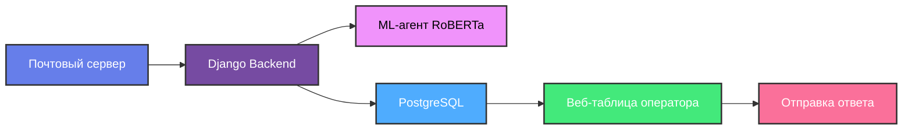
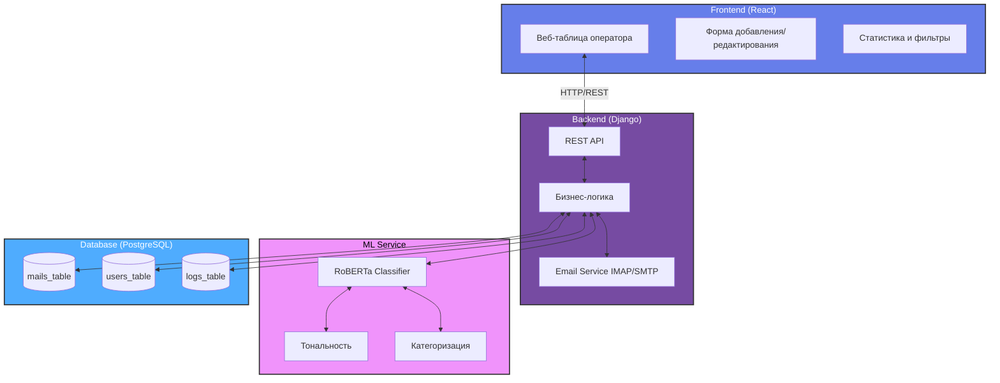
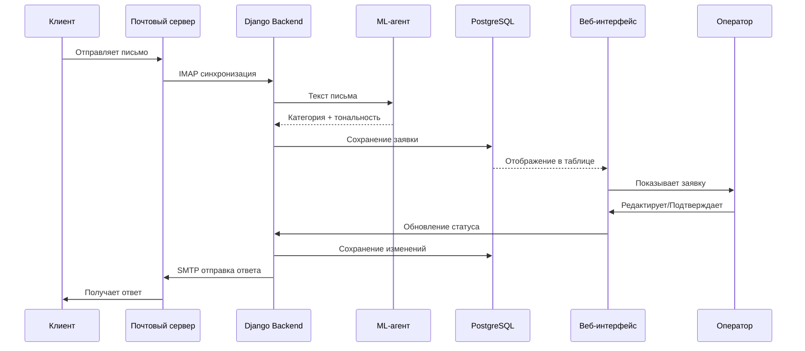
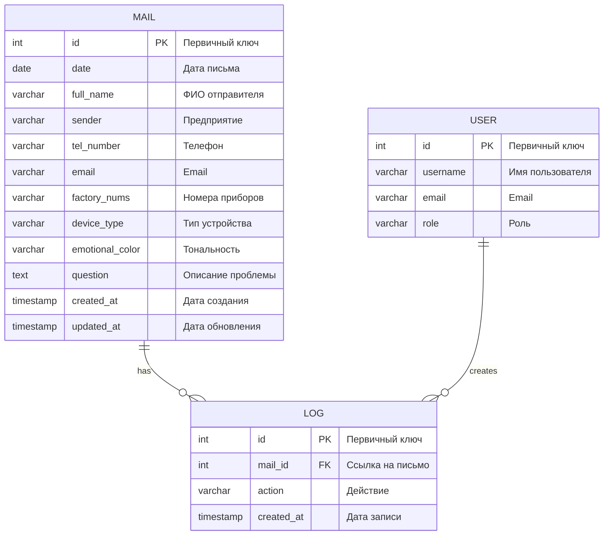

# Enigma Support Agent

**AI-агент для автоматизации обработки писем технической поддержки**

Предварительное задание для отбора на хакатон **ENIGMA HACK**.

---

## 1. Информация о команде

| Параметр | Значение |
|----------|----------|
| **Название команды** | bratva inc. |
| **Участники** | 5 человек |
| **Тимлид** | Иванов Дмитрий Игоревич |
| **Telegram** | @awakkken |
| **Репозиторий** | (https://github.com/SaintMaksim/Enigma_test.git) |

### Состав команды и роли

| Участник | Роль | Зона ответственности |
|----------|------|---------------------|
| Гущин Андрей Александрович | ML Engineer | Классификация писем, модель RoBERTa |
| Гатаулин Данил Валерьевич | ML Engineer | Предобработка текста, пайплайны данных |
| Иванов Дмитрий Игоревич | Backend Lead | Django, API, бизнес-логика |
| Дзюбинский Ярослав Андреевич | DevOps Lead | Docker, docker-compose, развёртывание |
| Таран Максим Сергеевич | Frontend Lead | Веб-интерфейс, таблица заявок |

---

## 2. Пользовательский путь (User Journey)

Оператор технической поддержки взаимодействует с системой по следующему сценарию:

| Шаг | Действие | Описание |
|-----|----------|----------|
| 1 | **Получение письма** | Письмо от клиента поступает на почтовый сервер (IMAP) |
| 2 | **Извлечение данных** | Django-сервис забирает письмо, извлекает тему и текст |
| 3 | **AI-анализ** | ML-модель (RoBERTa) определяет категорию, приоритет и тональность |
| 4 | **Сохранение** | Заявка сохраняется в PostgreSQL со статусом "Новая" |
| 5 | **Отображение** | Заявка появляется в веб-таблице оператора (Django Admin/UI) |
| 6 | **Просмотр** | Оператор видит тему, текст, AI-категорию и предложенный ответ |
| 7 | **Редактирование** | Оператор может скорректировать категорию или текст ответа |
| 8 | **Отправка** | Оператор подтверждает и отправляет ответ клиенту (SMTP) |
| 9 | **Завершение** | Статус заявки меняется на "Выполнена" |

## 3.Схема процесса

## 4. Схема взаимодействия компонентов

### Последовательность обработки письма

## 5. Структура проекта

| Путь | Файл | Назначение |
|------|------|------------|
| `backend/` | `config/settings.py` | Настройки Django (БД, middleware, apps) |
| `backend/` | `config/urls.py` | Корневая маршрутизация |
| `backend/` | `mails/models.py` | Модель Mail (поля письма) |
| `backend/` | `mails/views.py` | API endpoints для заявок |
| `backend/` | `mails/admin.py` | Регистрация модели в админке |
| `backend/` | `mails/serializers.py` | Сериализация данных для API |
| `backend/` | `manage.py` | Утилита управления Django |
| `backend/` | `requirements.txt` | Python зависимости |
| `frontend/` | `src/App.jsx` | Главный React компонент |
| `frontend/` | `src/App.css` | Стили таблицы заявок |
| `frontend/` | `src/api.js` | Fetch-запросы к бэкенду |
| `frontend/` | `package.json` | Node.js зависимости |
| `frontend/` | `vite.config.js` | Настройки сборщика Vite |
| `./` | `docker-compose.yml` | Оркестрация Docker-контейнеров |
| `./` | `Dockerfile` | Образ для развёртывания |
| `./` | `.env.example` | Шаблон переменных окружения |
| `./` | `README.md` | Документация проекта |

## 6. Схема базы данных

